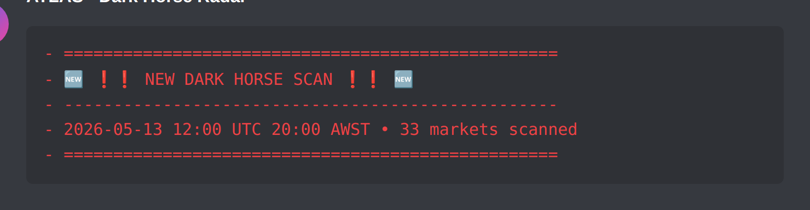
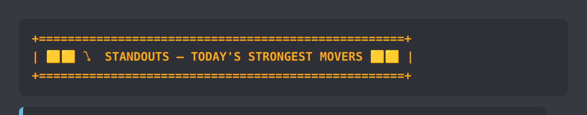
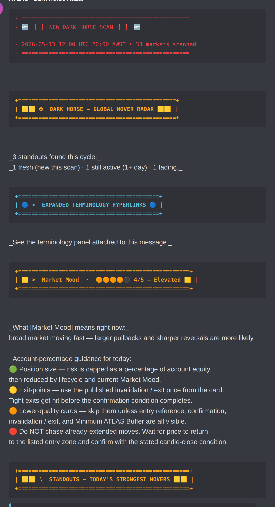
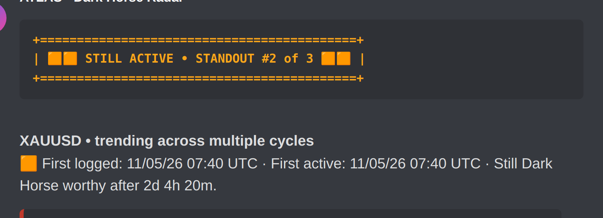
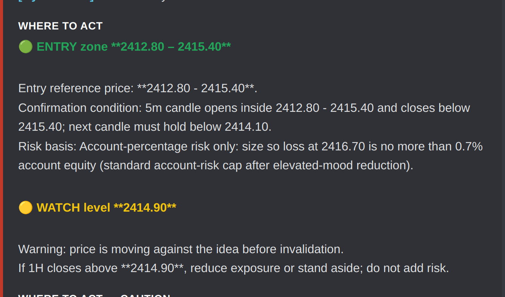
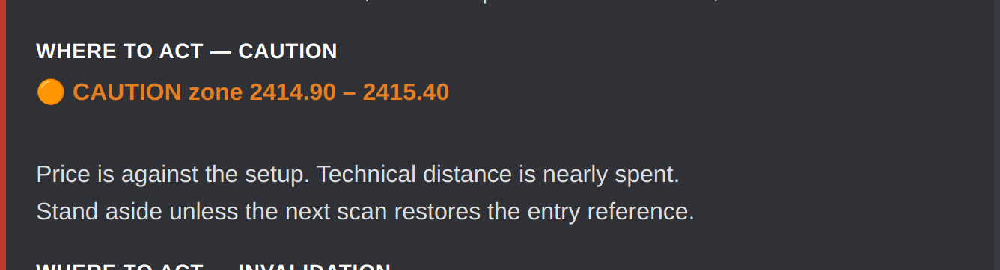
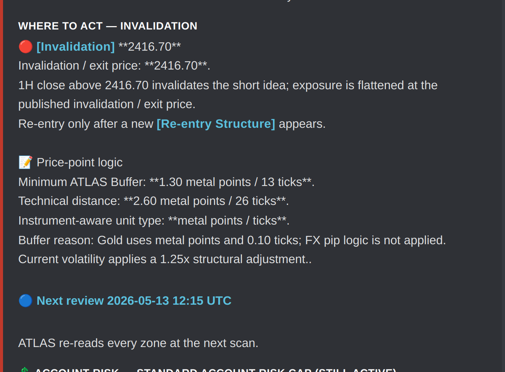
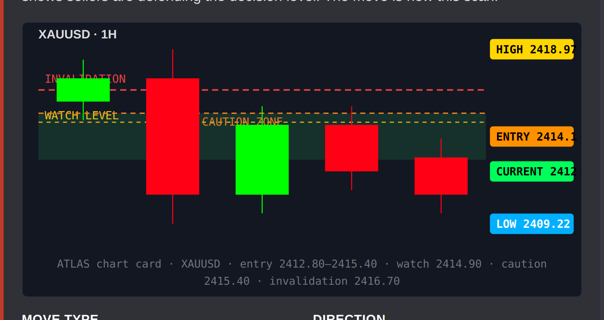

# ATL-6 — Dark Horse FOH v6 Cursor-rewrite visual parity proof

**Endpoint:** CURSOR REWRITE VISUAL PARITY PASS

Source of truth for this proof: `darkHorseFoh.buildDarkHorseFohPayload()` rendered through the live-path fixture and chart-card PNG attachment renderer.

Hard boundary observed: this proof run does not touch scoring, thresholds, scanner logic, Corey, Jane, Spidey, scheduler, transport, market selection, candidate promotion rules, macro engine, structural engine, decision engine, or Discord send/chunking/cooldown logic.

## iPad-readable proof gate

### 1. Full-width Discord output screenshot

### 2. Zoomed crop — NEW DARK HORSE SCAN

### 3. Zoomed crop — STANDOUTS — TODAY'S STRONGEST MOVERS

### 4. Zoomed crop — EXPANDED TERMINOLOGY HYPERLINKS

### 5. Zoomed crop — STILL ACTIVE heading

### 6. Zoomed crop — first logged / first active timestamp + active duration

### 7. Zoomed crop — Entry / Watch / Caution / Invalidation zones

### 8. Zoomed crop — matching heading / text / rendered chart colours

## Side-by-side proof

| Surface | Prototype screenshot | Current staged Discord output | Verdict / delta |
|---|---|---|---|
| Banner + Market Mood |  |  | PASS — hierarchy, market mood, terminology, dollars-first guidance present. Live path splits FRESH into M2 because M1 is 1916/2000 chars before adding a candidate separator. |
| FRESH card |  |  | PASS — lifecycle, 5-disc conviction, dollar risk, What This Means, WHAT TO DO NOW, confirms/cancels present. |
| STILL ACTIVE card |  |  | PASS — outlined active lifecycle, full-size/elevated-mood dollar language, confirmation/cancel story present. |
| FADING card |  |  | PASS — late-stage lifecycle, quarter-size risk, caveat and skip language present. |
| BUILDING / Chart Reference |  |  | PASS — BUILDING surface and chart reference embed present; chart is also delivered as PNG attachment, not text fallback. |

## Delta table

| Required surface / check | Status | Exact delta |
|---|---|---|
| NEW DARK HORSE SCAN alert | PASS | Red diff alert is visually stronger than plain ASCII and sits at the top of the Discord output. |
| STANDOUTS — TODAY'S STRONGEST MOVERS | PASS | Gold/yellow section identity preserved. |
| FRESH / initial standout | PASS | Yellow/gold lifecycle treatment. |
| STILL ACTIVE standout | PASS | Orange/amber lifecycle treatment with first logged, first active, and active duration. |
| FADING standout | PASS | Red-orange lifecycle treatment explains weakening / cancellation / restoration. |
| Entry / Watch / Caution / Invalidation | PASS | Green / yellow / orange / red text zones and matching chart-card markers. |
| EXPANDED TERMINOLOGY HYPERLINKS | PASS | Exact heading text retained and rendered blue/cyan. |
| FRESH card | PASS | Full v6 field set restored. |
| STILL ACTIVE card | PASS | Full v6 field set restored. |
| FADING card | PASS | Full v6 field set restored, including late-stage caveat. |
| BUILDING / Chart Reference | PASS | Reference surface restored with rendered chart-card PNG attachment. |
| Dollar Risk This Trade | PASS | Lifecycle-aware dollar-first sizing on every candidate. |
| What This Means | PASS | Present on every candidate. |
| WHAT TO DO NOW | PASS | Five-step checklist with dollar amounts on every candidate. |
| What Confirms / What Cancels | PASS | Present on every candidate. |
| Risk Reminder / Briefing Summary tail | PASS | Tail restored with next-scan summary. |
| Density matches prototype | PASS | Discord split is constrained by 2000-char content cap; no content surface removed. |
| Layout hierarchy matches prototype | PASS | Same order: banner, FRESH, STILL ACTIVE, FADING, BUILDING/chart reference, tail. |
| Dollar-first action language visible | PASS | Dollar amounts visible in Market Mood, Dollar Risk, Where to Act, and WHAT TO DO NOW. |
| Lifecycle storytelling visible | PASS | FRESH / STILL ACTIVE / FADING separators and card copy present. |
| 5-disc severity bars visible | PASS | Market Mood and Conviction use 5-disc bars with inactive `⚫`. |
| Colour hierarchy preserved as Discord allows | PASS | diff/ansi fences, embed colors, emoji zones, bold price tokens, and chart PNG colors preserve hierarchy. Colour-critical sections do not rely on plain grey/white ASCII alone. |
| No placeholder chart fallback as standard | PASS | Live transport renders and posts PNG files via `attachment://...`; no pending/text chart substitute. |
| No text-mode chart substitution | PASS | Chart-card PNG files generated for 3 candidates + reference card. |
| No banned wording | PASS | FOH QA banned-word sweep is green. |

## Chart PNG attachment proof

- `dh-foh-01-eurusd-1h.png`
- `dh-foh-02-xauusd-1h.png`
- `dh-foh-03-nvda-1h.png`
- `dh-foh-04-reference-pattern.png`

## Generated artifacts

- `dh-foh-v6-live-current.html`
- `dh-foh-v6-live-current.png`
- `dh-foh-v6-live-current.pdf`
- `dh-foh-v6-live-current-section-1-banner.png`
- `dh-foh-v6-live-current-section-2-fresh.png`
- `dh-foh-v6-live-current-section-3-still-active.png`
- `dh-foh-v6-live-current-section-4-fading.png`
- `dh-foh-v6-live-current-section-5-reference-card.png`
- `dh-foh-v6-live-current-section-6-briefing-summary.png`
- `dh-foh-v6-live-current-detail-banner.png`
- `dh-foh-v6-live-current-detail-new-dark-horse-scan.png`
- `dh-foh-v6-live-current-detail-standouts-strongest-movers.png`
- `dh-foh-v6-live-current-detail-expanded-terminology-hyperlinks.png`
- `dh-foh-v6-live-current-detail-fresh-candidate-embed.png`
- `dh-foh-v6-live-current-detail-fresh-entry-watch-caution-invalidation-zones-1.png`
- `dh-foh-v6-live-current-detail-fresh-entry-watch-caution-invalidation-zones-2.png`
- `dh-foh-v6-live-current-detail-fresh-entry-watch-caution-invalidation-zones-3.png`
- `dh-foh-v6-live-current-detail-still-active-candidate-embed.png`
- `dh-foh-v6-live-current-detail-still-active-heading.png`
- `dh-foh-v6-live-current-detail-still-active-first-logged-duration.png`
- `dh-foh-v6-live-current-detail-still-active-entry-watch-caution-invalidation-zones-1.png`
- `dh-foh-v6-live-current-detail-still-active-entry-watch-caution-invalidation-zones-2.png`
- `dh-foh-v6-live-current-detail-still-active-entry-watch-caution-invalidation-zones-3.png`
- `dh-foh-v6-live-current-detail-matching-heading-text-rendering-colours.png`
- `dh-foh-v6-live-current-detail-fading-candidate-embed.png`
- `dh-foh-v6-live-current-detail-reference-card-embed.png`
- `attachments/` chart-card PNG files

**Final verdict:** CURSOR REWRITE VISUAL PARITY PASS
