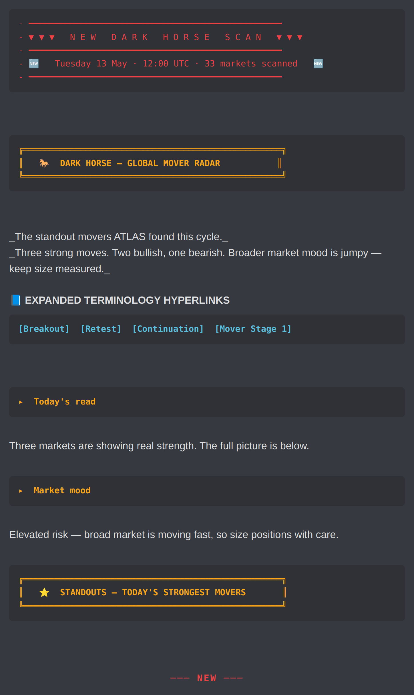
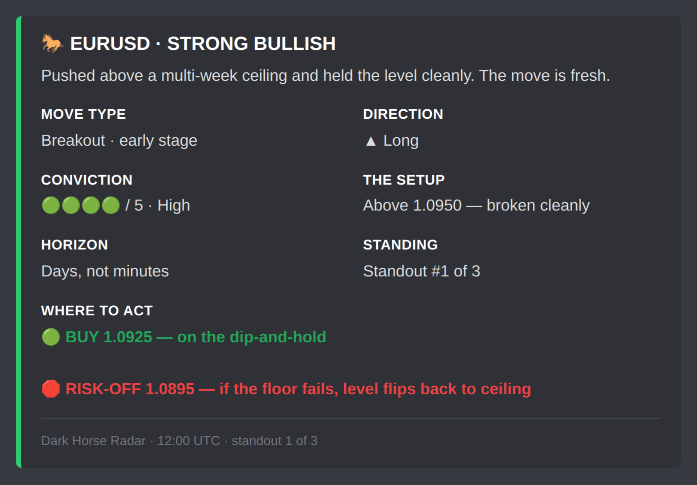
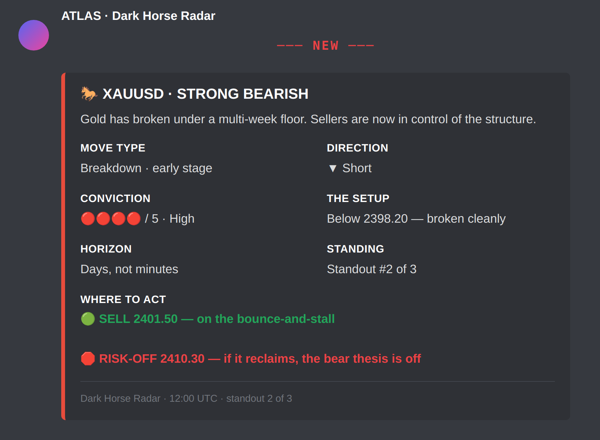
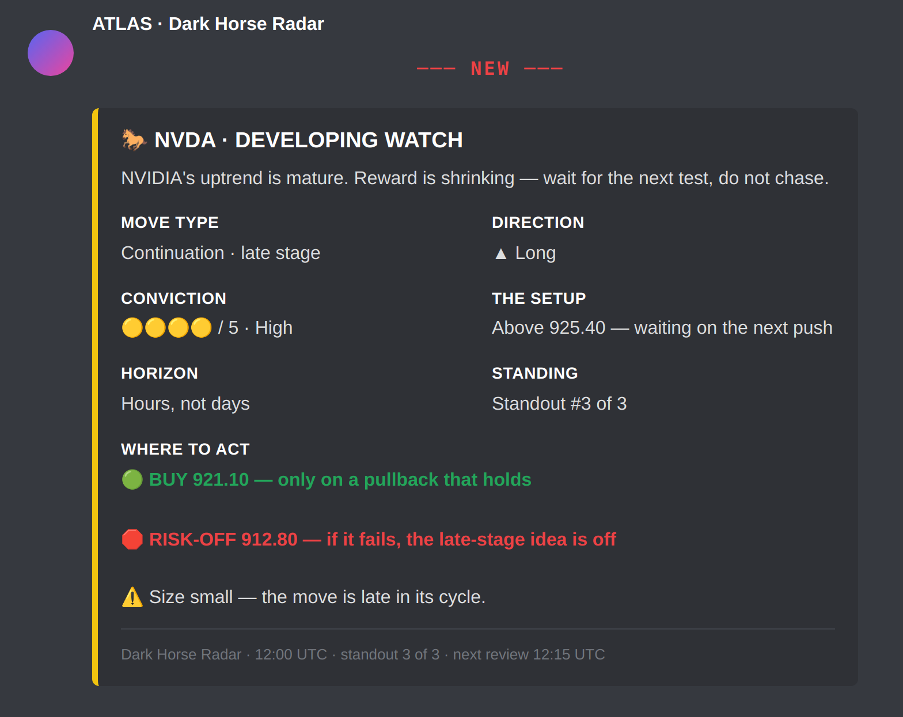
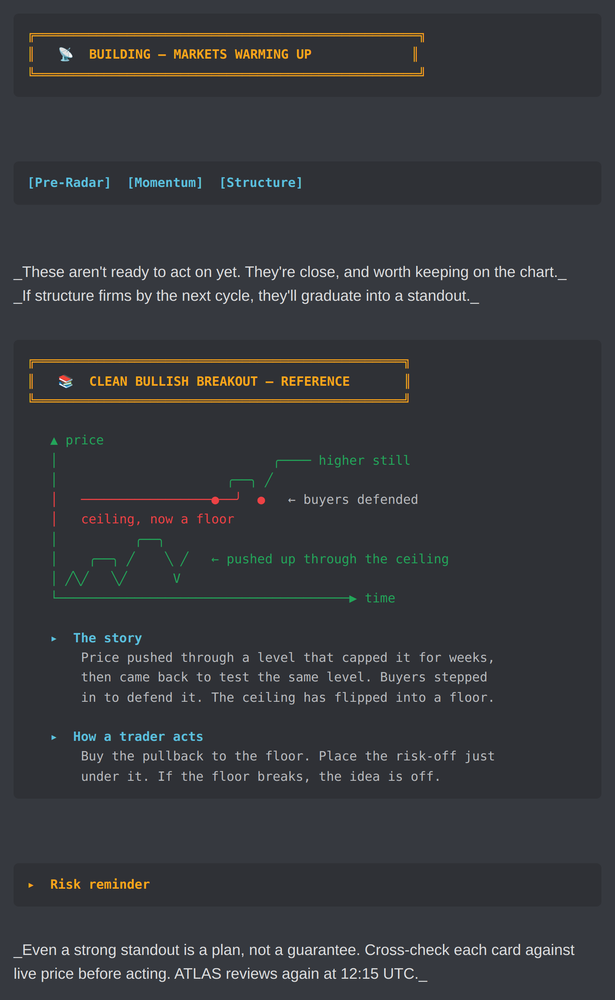
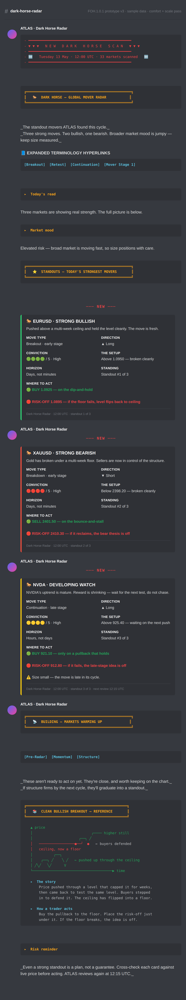

# Dark Horse FOH.1.0.1 — Visual Prototype v3 Gallery

Interim Gate-1 proof for [PR #65](https://github.com/herbertnathan28-123/ATLAS_DISCORD_PATHWAY/pull/65). Each artefact below is viewable inline on any device (iPad / iPhone / Mac / Windows) — no download required.

For the universally portable rendering, use the PDF (multi-page, scrollable, zoomable on every native viewer): [`dh-foh-prototype-v3.pdf`](dh-foh-prototype-v3.pdf).

---

## 1. The banner — red NEW divider, gold banner, teal terminology row, ▸ subheadings

This is the top of every Dark Horse scan post. The red `NEW DARK HORSE SCAN` block is the "change of scene" marker between the previous scan and the new one; the gold banner names the surface; the teal row carries the Pack 4 Expanded Terminology Hyperlinks chips; the bold-gold `▸` subheadings carry the at-a-glance read.

---

## 2. Standout candidate embed — STRONG BULLISH (EURUSD)

This is the per-candidate card. Larger 19px embed title, 16px description, 2-col field grid for comfort, UPPERCASE field labels, multi-line `Where to Act` with `BUY` and `RISK-OFF` on their own colour-banded lines.

---

## 3. Second candidate — STRONG BEARISH (XAUUSD)

Red left bar marks the bearish state. Same field structure, same multi-line Where-to-Act treatment.

---

## 4. Third candidate — DEVELOPING WATCH (NVDA)

Yellow left bar for late-stage caution. Card carries an extra `⚠️` line ("Size small — the move is late in its cycle.") on its own row in the Where-to-Act block — the trader sees the caveat without scanning prose.

---

## 5. Quiet-scan surface — `BUILDING` + visual reference card

Even when activity is low, the bottom of every scan delivers value: a Pre-Radar header for markets warming up, and a visual reference card (chart art + `▸ The story` + `▸ How a trader acts`) so the channel remains educational on quiet cycles.

---

## 6. Full scan (top to bottom)

The complete v3 prototype output in one frame. Use the PDF if this is too tall for your viewer.

---

## Gate status

| Gate | Status |
|---|---|
| 1 — local-rendered Discord-style preview | ✅ this gallery |
| 2 — live Discord screenshots from staging | held pending engine wire-up + operator trigger |

## Hard boundary preserved

No scoring / thresholds / scheduler / transport / Corey / Jane / Spidey / macro / Market Intel runtime / dashboard / renderer / ranking changes.

---

_Re-render the gallery with `node scripts/render_dh_foh_preview.js` from the repo root after `npm install`._
