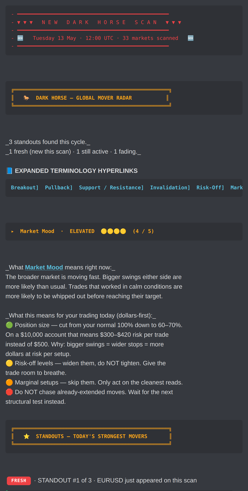
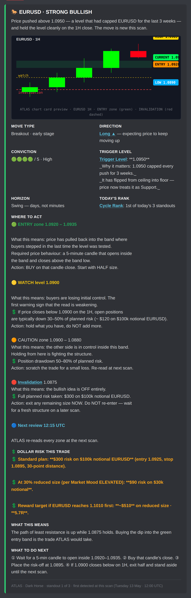
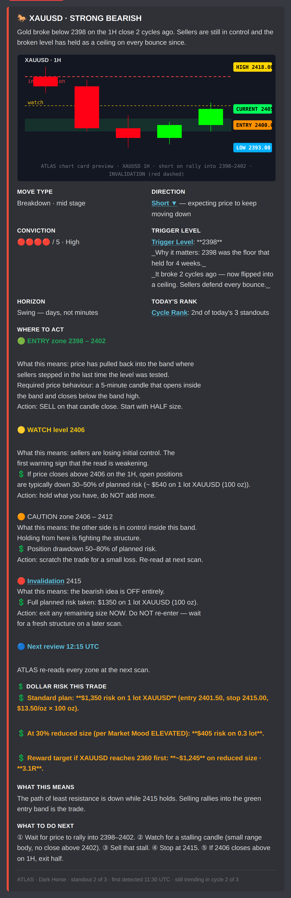
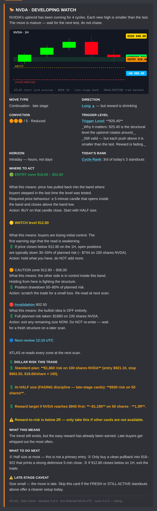
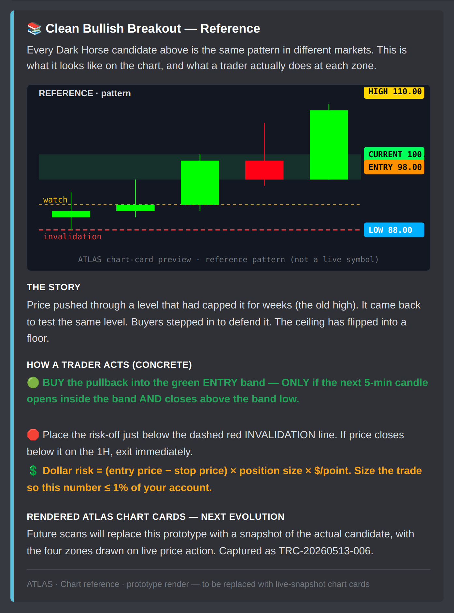

# Dark Horse FOH.1.0.1 — v5 Prototype Gallery

Doctrine-escalation pass on the v4 direction. Every operator annotation from the screenshot review is addressed.

📄 **PDF (recommended on iPad):** [`dh-foh-v5.pdf`](dh-foh-v5.pdf)
🖼️ **Full strip:** [`dh-foh-v5.png`](dh-foh-v5.png)

---

## Doctrine lock — what every statement now answers

Every important ATLAS statement on every card answers all six operator-locked questions:

1. **What does this mean?** — plain-English explanation under every label.
2. **Why does it matter?** — "Why it matters" sub-row under Trigger Level.
3. **What should I do?** — explicit `What to do next` row per card.
4. **What happens if it changes?** — multi-zone Where to Act spells out the consequence at each level.
5. **Risk in dollars first, not pips** — every card has a `💲 Dollar risk this trade` row with concrete numbers; pip context is a footnote only.
6. **Healthy vs Caution vs Danger vs Invalidation** — explicit zones with consequence + action at each.

---

## v4 → v5 deltas (every operator annotation addressed)

| Operator note | v5 fix |
|---|---|
| "Long needs hyperlink explanation" | `[Long ▲](#term-long)` — Discord renders in native cyan link colour |
| "THE SETUP — what does this mean?" | Renamed to **Trigger Level**, with `[Trigger Level](#term-trigger-level)` hyperlink, plus `_Why it matters:_` sub-row explaining the level (e.g. "1.0950 capped every push for 3 weeks — flipped from ceiling into floor") |
| "STANDING — what does this mean?" | Renamed to **Today's Rank** with `[Cycle Rank](#term-cycle-rank)` hyperlink and ordinal value ("1st of today's 3 standouts") |
| "Can't be exact price? Entry zone shows 1.0924–1.0926" | Entry zone now spans a BAND (`1.0920 – 1.0935`) + required price behaviour ("5-min candle opens inside the band AND closes above the band low") |
| "RISK-OFF hyperlink + exact price + what is it advising us" | Renamed to **🛑 Invalidation** with `[Invalidation](#term-invalidation)` hyperlink + exact price + concrete action ("exit any remaining size NOW. Do NOT re-enter") |
| "On the dip and hold is what? Makes no sense in layman's terms" | Replaced with: "if price dips back here and holds — required behaviour: 5-min candle opens inside the band AND closes above the band low. Action: BUY on that candle close. Start with HALF size." |
| "Short requires hyperlink explanation" | `[Short ▼](#term-short)` — same hyperlink treatment as Long |
| "What is it telling us to do??" (multiple) | Each card now has explicit `What this means` + `What to do next` rows with numbered ① ② ③ steps |
| "We deal in $$$ not pips" | Every card has a `💲 Dollar risk this trade` row with concrete numbers (e.g. "$300 risk on $100k notional EURUSD"). Pip context is a footnote, not the lead. |
| "NEW solid box if new to current scan; outlined box if 1+ day still trending" | Renderer-side filled/outlined NEW badge variants. **FRESH** = solid red filled with white text. **STILL ACTIVE** = outlined red. **FADING** = outlined orange. |
| "How a trader acts needs more specific instructions" | Reference card now lists numbered ① ② ③ steps with explicit price behaviour requirements |
| "Needs your rendered charts for visual impact" | Every candidate now carries an SVG ATLAS-styled chart card using the locked palette (#00ff00 / #ff0015 / #131722 / HIGH yellow / CURRENT green / ENTRY orange / LOW blue from CLAUDE.md). Prototype-only — real chart-render lane is captured as TRC-20260513-006. |

---

## Per-section inline previews

### 1. Banner + Market Mood + Standouts banner + FRESH candidate

Red NEW DARK HORSE SCAN divider, gold banner, italic scan summary, teal Expanded Terminology Hyperlinks, Market Mood traffic-light section (🟡🟡🟡🟡 4/5 ELEVATED) with concrete dollar-sized behaviour guidance ("$300–$420 risk per trade instead of $500 on a $10,000 account"), gold ⭐ STANDOUTS banner, and the red SOLID FILLED **FRESH** badge above the first candidate.

### 2. FRESH candidate embed — EURUSD with all doctrine items

Green state left bar. ATLAS-styled chart card at the top (candles + entry zone green band + invalidation red dashed line + HIGH/CURRENT/ENTRY/LOW price labels in locked palette). Every field carries the doctrine treatment:

- **Direction**: `[Long ▲](#term-long) — expecting price to keep moving up`
- **Trigger Level**: `[Trigger Level](#term-trigger-level): **1.0950**` + `_Why it matters:_` sub-row
- **Today's Rank**: `[Cycle Rank](#term-cycle-rank): 1st of today's 3 standouts`
- **Where to Act**: 4 zones × (level + observation + dollar drawdown + action)
- **💲 Dollar risk this trade**: 3-line breakdown with standard plan / reduced plan / reward target
- **What this means**: 1-line plain-English read
- **What to do next**: numbered ① ② ③ ④ steps

### 3. STILL ACTIVE candidate — XAUUSD (cycle 2)

Outlined red **STILL ACTIVE** badge (not filled — operator directive for ≥1 day continuing). Red state left bar. Bearish chart card with sell-on-bounce entry band. Same doctrine treatment across every field.

### 4. FADING candidate — NVDA (late stage)

Outlined orange **FADING** badge. Orange state left bar. Conviction reduced to 🟠🟠🟠 (3/5). Carries an explicit `⚠️ Late-stage caveat` row + reward-to-risk warning (1.3R on reduced size).

### 5. BUILDING + chart reference embed

Outlined red **BUILDING** badge for pre-radar markets warming up. Magenta-accent BUILDING section banner (multi-colour hierarchy in action — not all gold). Reference embed carries: the story / how a trader acts (numbered steps) / dollar-risk formula / TRC-20260513-006 flag for the rendered-chart next-evolution.

---

## Gate status

| Gate | Status |
|---|---|
| 1 — local-rendered Discord-style preview | ✅ this gallery |
| 2 — live Discord screenshots from staging | held — needs engine wire-up of v5 changes (operator approval required first) |

## Wire-up status (HELD)

- v3 wire-up of `darkHorseFoh.buildDarkHorseFohPayload` stays current on the branch.
- v4 + v5 changes are NOT yet wired. Wire-up follows operator visual sign-off.

## Hard boundary preserved

No scoring / thresholds / scheduler / transport / Corey / Jane / Spidey / macro engine / Market Intel runtime / dashboard / renderer.js / ranking changes.

---

_Re-render with `node scripts/render_dh_foh_v5_preview.js`._
