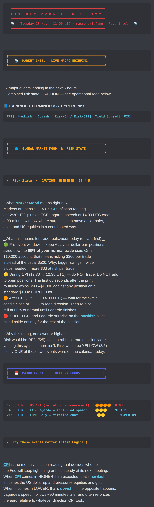
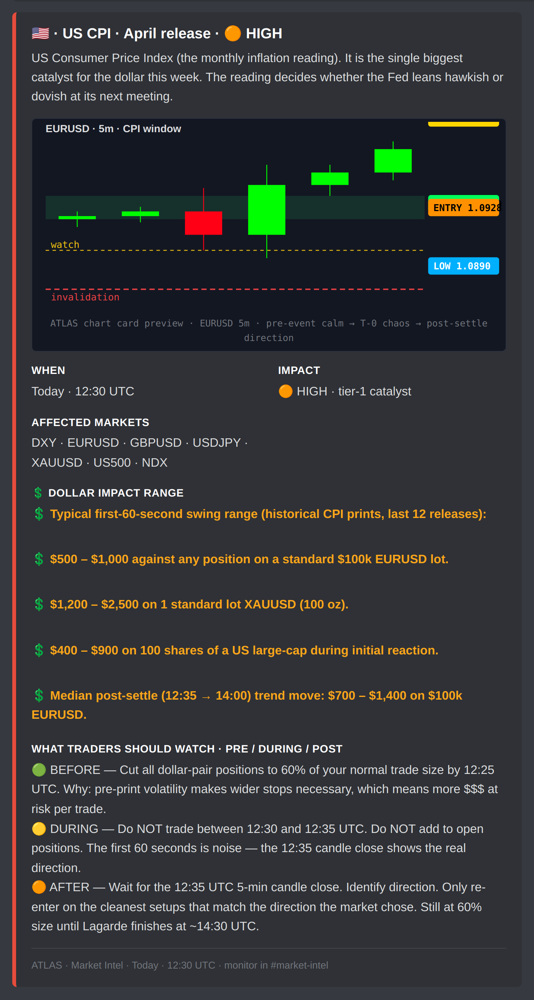
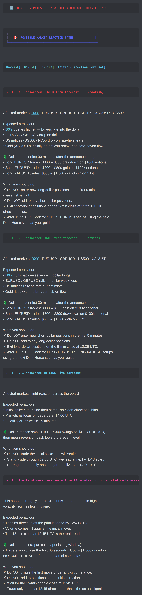
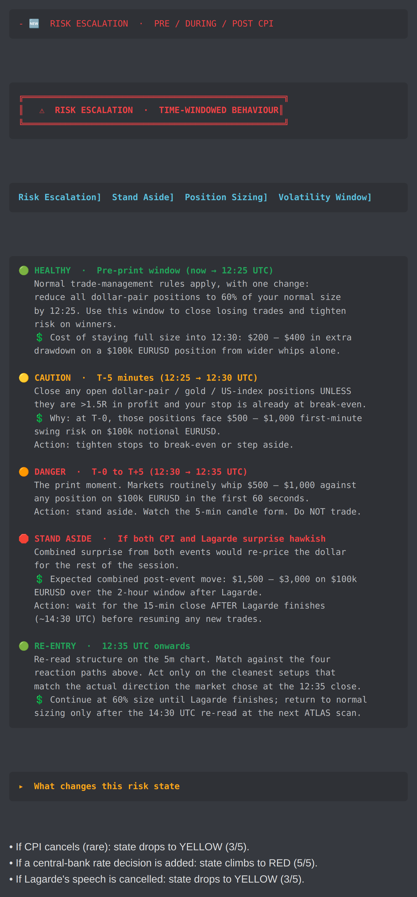
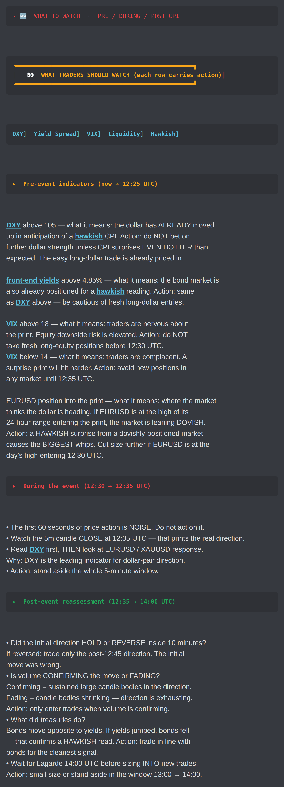
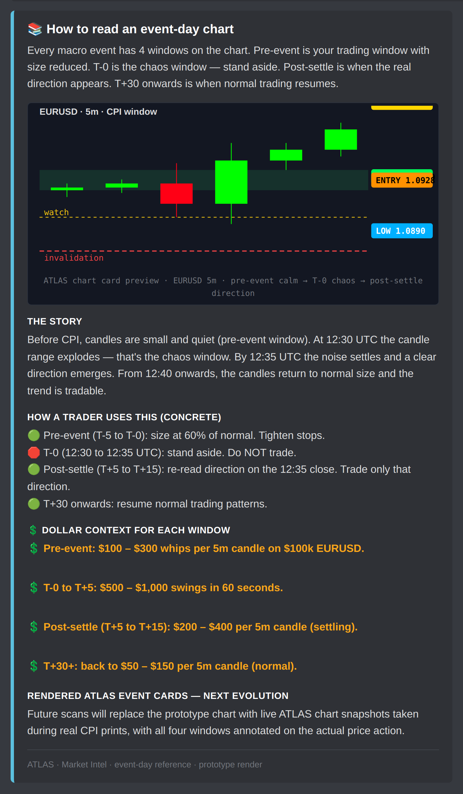

# Market Intel FOH.1.0.1 — v2 Prototype Gallery

Doctrine-escalation pass on the v1 prototype. Every operator annotation from the screenshot review is addressed.

📄 **PDF (recommended on iPad):** [`market-intel-foh-v2.pdf`](market-intel-foh-v2.pdf)
🖼️ **Full strip:** [`market-intel-foh-v2.png`](market-intel-foh-v2.png)

---

## v1 → v2 wording rewrites

| Operator note (from v1 annotation) | v2 fix |
|---|---|
| "CPI PRINTS ???" | Replaced everywhere: "CPI announced HIGHER than forecast" / "CPI announced LOWER than forecast" / "CPI announced IN-LINE with forecast" |
| "Remove prints terminology" | All "prints" wording removed from prose; the word "the print" stays only in the time-window discussion (T-0 = the print moment) and is contextualised |
| "Trader read? Not clear on exactly what it's implying" | Replaced with explicit `What you should do` block per scenario, with ✘ DO NOT items and ✓ DO items |
| "Whipsaw ??? Both sides print quickly???" | Renamed to "Initial-direction reversal" with [hyperlink](#term-initial-direction-reversal). Body: "the first direction off the announcement is faded by 12:40 UTC. Volume comes IN against the initial move." |
| "Be more specific on advice" | Every reaction path now has `What you should do` numbered actions with ✘ ✓ markers |
| "We deal in $$$ not pips" | Every wording instance of "pips" replaced with concrete dollar amounts. Example: "Markets often whipsaw 50–100 pips" → "Markets routinely whip $500 – $1,000 against any position on a standard $100k EURUSD lot." |
| "Cut size — what position, by how much, why" | Pre-event guidance now reads: "Cut all dollar-pair positions to 60% of your normal trade size by 12:25 UTC. On a $10,000 account, that means risking $300 per trade instead of the usual $500. Why: bigger swings = wider stops needed = more $$$ at risk per trade." |
| "Hawkish hyperlink" | `[hawkish](#term-hawkish)` + `[dovish](#term-dovish)` + `[CPI](#term-cpi)` + `[risk-on](#term-risk-on)` + `[risk-off](#term-risk-off)` + `[yield spread](#term-yield-spread)` + `[VIX](#term-vix)` + `[DXY](#term-dxy)` + `[front-end yields](#term-front-end)` all hyperlinked at first mention |
| "What does all of this mean for us / should do ???" | Every indicator row in "What Traders Should Watch" now ends with `Action:` + concrete instruction. Example: "DXY above 105 — what it means: the dollar has ALREADY moved up. Action: do NOT bet on further dollar strength unless CPI surprises EVEN HOTTER." |
| "Whipsaw remove for something else" | Renamed to "Initial-direction reversal" with definition inline: "This happens roughly 1 in 4 CPI prints — more often in high-volatility regimes like this one." |
| "Good but needs proper rendered chart" | Event-day reference card now carries an SVG ATLAS-styled chart card (locked palette) showing pre-event quiet → T-0 chaos → post-settle direction. Real chart-snapshot wiring captured as next-evolution flag. |
| "Expand on entry exit strategies / price points" | Every reaction path now lists concrete affected markets + behaviour + dollar impact + action; risk-escalation zones list dollar impact for each window |

---

## 4 reaction paths — HIGHER / LOWER / IN-LINE / CONFLICTING

The v1 had `Hawkish surprise / Dovish surprise / In-line / Whipsaw`. v2 renames to plain-English outcomes and adds dollar-impact + concrete action per path:

| Path | Detail |
|---|---|
| **IF CPI announced HIGHER than forecast** ([hawkish](#term-hawkish)) | Affected markets, expected behaviour, dollar impact range ($300–$800 on $100k EURUSD), what you should do (✘ items + ✓ items) |
| **IF CPI announced LOWER than forecast** ([dovish](#term-dovish)) | Same structure, mirror direction |
| **IF CPI announced IN-LINE with forecast** | Light reaction, mean-reversion expected, stand aside through T+5, re-engage at Lagarde |
| **IF the first move reverses within 10 minutes** ([initial-direction reversal](#term-initial-direction-reversal)) | The biggest dollar trap on event days. Concrete dollar drawdown for chasers ($800–$1,500 on $100k EURUSD) + ✘ ✓ action items |

---

## Per-section inline previews

### 1. Banner + Global Market Mood + Major Events list

Red NEW MARKET INTEL divider (📡 macro briefing badge — distinct from Dark Horse's 🆕 stamp), gold MARKET INTEL banner, teal terminology row with CPI/Hawkish/Dovish/Risk-On-Off/Yield Spread/VIX hyperlinks. Global Risk State traffic-light section with dollar-sized behaviour guidance per zone ("$300 per trade instead of the usual $500" / "$500–$1,000 first-minute swing risk"). Blue-accent MAJOR EVENTS banner with chronological list.

### 2. US CPI event card with ATLAS-styled chart card

State-coloured red HIGH-impact left bar. Country flag + event name + impact in title. **ATLAS-styled chart card** at the top showing the EURUSD 5m candles in the CPI window (pre-event quiet → T-0 chaos → post-settle direction) using the locked palette colours from CLAUDE.md. Fields: When / Impact / Affected Markets / **💲 Dollar impact range** (5 bullet points of concrete $$$ figures, no pips) / What Traders Should Watch (BEFORE / DURING / AFTER colour-banded).

### 3. 4 reaction paths — IF / THEN

Four colour-accented ▸ subheadings (red HAWKISH / green DOVISH / cyan IN-LINE / magenta REVERSAL). Each path lists: affected markets, expected behaviour per market, dollar impact range, what you should do (✘ DO NOT items + ✓ DO items). No "prints" or "whipsaw" jargon left unexplained.

### 4. Risk escalation — time-windowed multi-zone

5-zone breakdown: 🟢 HEALTHY / 🟡 CAUTION / 🟠 DANGER / 🛑 STAND ASIDE / 🟢 RE-ENTRY. Each zone names the time window, the price-action expectation, the dollar drawdown range, and the concrete trader action. The MAGENTA section banner (instead of gold) is the multi-colour hierarchy operator-asked-for.

### 5. What traders should watch — each indicator carries its own action

Every indicator (DXY / front-end yields / VIX / EURUSD position) now ends with `Action:` + concrete instruction. No floating "the market is doing X" leaves the trader guessing. Hyperlinks on every domain term.

### 6. Event-day reference card (ATLAS-styled SVG chart)

Cyan-accent reference card. The 4-window chart drawn as an SVG ATLAS-styled chart card showing the actual visual pattern (pre-event small candles → wide T-0 range → settling → normal). Fields: story / how a trader uses this / **💲 Dollar context for each window** (concrete swing-range per 5m candle per window).

---

## Doctrine-lock checklist — every section

| Question | Coverage |
|---|---|
| 1. What does this mean? | Every label has plain-English explanation under it |
| 2. Why does it matter? | Banner subheadings + "_Why this rating, not lower or higher_" + per-event "Why these events matter" |
| 3. What should I do? | Every reaction path + every risk-escalation zone + every indicator carries an explicit `Action:` row |
| 4. What happens if it changes? | "What changes this risk state" block names the 3 things that move the rating up or down |
| 5. Risk in dollars first | Every event card has a `💲 Dollar impact range` field; every risk-escalation zone names $$$; pips appear only as parenthetical context |
| 6. Healthy → Caution → Danger → Invalidation | Risk escalation has 5 explicit zones (HEALTHY / CAUTION / DANGER / STAND ASIDE / RE-ENTRY) with time-window + dollar-impact + action per zone |

## Gate status

| Gate | Status |
|---|---|
| 1 — local-rendered Discord-style preview | ✅ this gallery |
| 2 — live Discord screenshots from staging | held — Market Intel runtime is NOT touched in this PR |

## Hard boundary preserved

NO scoring / thresholds / scheduler / transport / Corey / Jane / Spidey / macro engine / Market Intel **runtime** / dashboard / renderer.js / ranking changes. The prototype script imports only `_foh_renderer.js` (shared Discord-style HTML/CSS preview) — no Market Intel runtime surface.

---

_Re-render with `node scripts/render_market_intel_foh_v2_preview.js`._
