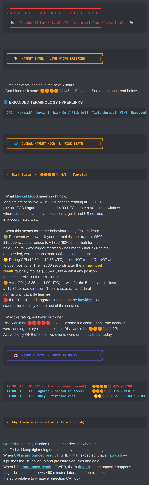
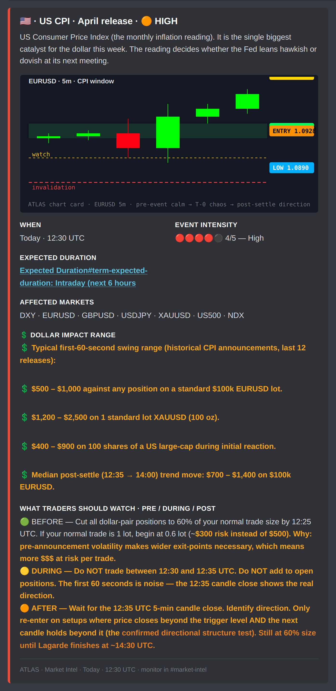
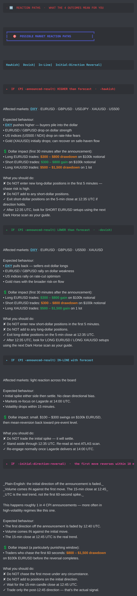
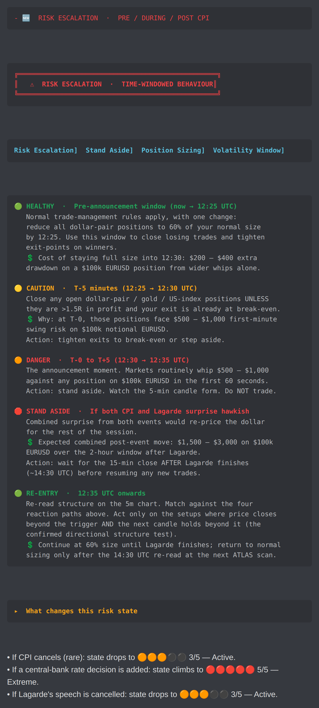
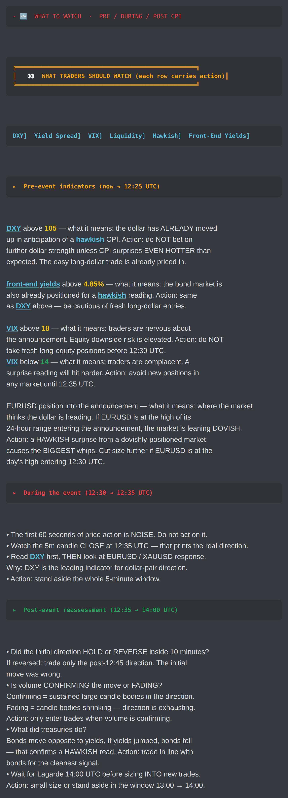
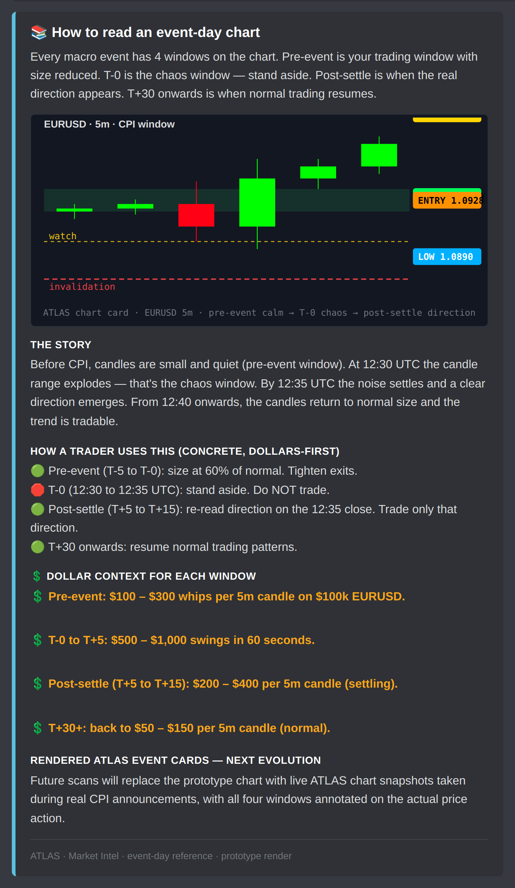

# Market Intel FOH.1.0.1 — v3 Prototype Gallery

Doctrine v6 priorities applied to the Market Intel surface.

📄 **PDF:** [`market-intel-foh-v3.pdf`](market-intel-foh-v3.pdf)
🖼️ **Full strip:** [`market-intel-foh-v3.png`](market-intel-foh-v3.png)

---

## v2 → v3 changes (10-priority pass)

| # | Priority | v3 fix |
|---|---|---|
| 1 | 5-disc severity | Risk State now reads `🟠🟠🟠🟠⚫ 4/5 — Elevated` with inactive `⚫`. Event Intensity per event uses the same scale: `🟠🟠🟠🟠⚫ 4/5 — HIGH` for CPI, `🟠🟠🟠⚫⚫ 3/5 — MEDIUM` for Lagarde, `🟡🟡⚫⚫⚫ 2/5 — LOW-MEDIUM` for FOMC Daly. |
| 2 | Abstract language removed | "Print" replaced everywhere with "announced result" (with hyperlink stub). "Whipsaw" replaced with "Initial-direction reversal" + plain-English definition. "Cleanest read" translated to "setups where price closes beyond the trigger level AND the next candle holds beyond it (the confirmed directional structure test)". |
| 3 | Dollar-first | Every action references dollars first. "Cut to 60%" reads "If your normal risk is $500, reduce to ~$300". |
| 4 | Colour-coded prices | Watch levels render yellow (`{{watch:105}}`), entry levels green (`{{entry:14}}`), drawdown amounts orange (`{{caution:$300 – $800 drawdown}}`), gain amounts green (`{{entry:$300 – $800 gain}}`). |
| 5 | Terminology renames | `Print` → **Announced result** · `Whipsaw` → **Initial-direction reversal** · `Horizon` → **Expected Duration** · `Clean structure` → **Confirmed directional structure** |
| 6 | Consequence-based | Every reaction path + risk-escalation zone + indicator row answers What it means / Why it matters / What to do / Financial cost. |
| 7 | Tighter execution | Reaction paths now name specific dollar drawdowns ($300–$800 on $100k EURUSD) instead of generic "wider swings". |
| 8 | Rendered chart cards | ATLAS-styled event-day chart card on the CPI event + reference card. |
| 9 | Action translation | Every reaction path + risk-escalation zone + indicator carries explicit `Action:` instruction. Briefing summary ends with 5 numbered steps. |
| 10 | Hard boundary | No Market Intel runtime touched. Prototype script imports only `_foh_renderer.js`. |

---

## Per-section inline previews

### 1. Banner + Global Risk State (5-disc) + Major Events list

Red NEW MARKET INTEL divider, gold banner, teal terminology row with CPI / Hawkish / Dovish / Risk-On-Off / Yield Spread / VIX / Expected Duration hyperlinks. Global Risk State now reads `🟠🟠🟠🟠⚫ 4/5 — Elevated`. Each major event in the list carries its own disc-scale rating.

### 2. CPI event card with ATLAS-styled chart + intensity disc + Expected Duration

Event Intensity field: `🔴🔴🔴🔴⚫ 4/5 — High`. Expected Duration: "Intraday (next 6 hours)". Description uses "announced result" instead of "prints". Multi-line What Traders Should Watch with BEFORE / DURING / AFTER zone breakdown.

### 3. 4 reaction paths — HIGHER / LOWER / IN-LINE / Initial-direction reversal

Path 4 renamed from "Whipsaw" to "Initial-direction reversal" with plain-English definition. Dollar drawdown / gain amounts colour-coded inline (orange for losses, green for gains).

### 4. Risk escalation — multi-zone time-window

Same 5-zone breakdown as v2 (HEALTHY / CAUTION / DANGER / STAND ASIDE / RE-ENTRY) with the "What changes this risk state" footer now using disc-scale references: "state drops to 🟠🟠🟠⚫⚫ 3/5 — Active" / "state climbs to 🔴🔴🔴🔴🔴 5/5 — Extreme".

### 5. What traders should watch — indicators with watch-coloured levels

DXY `{{watch:105}}`, front-end yields `{{watch:4.85%}}`, VIX `{{watch:18}}` and `{{entry:14}}` all colour-coded per the doctrine-lock.

### 6. Event-day reference (ATLAS-styled SVG chart)

---

## Gate status

| Gate | Status |
|---|---|
| 1 — local-rendered Discord-style preview | ✅ this gallery |
| 2 — live Discord screenshots from staging | held — Market Intel runtime is NOT touched |

## Hard boundary preserved

No Market Intel **runtime** touched. The prototype script imports only `_foh_renderer.js` and uses no engine surface.

---

_Re-render with `node scripts/render_market_intel_foh_v3_preview.js`._
